# 城下秋草 · 图片生成 Skill & Prompt

前端设计图鉴、组件参考、动效与拟人插画：**先看合集，选中后点击图片下方的链接领取。**

**小白直接复制 Prompt（完整提示词）给支持生图的 AI 即可，不需要写代码。** 图片可点击放大；Skill 是对应主题的可复用规则。

[网页与 App 视觉风格](#网页与-app-视觉风格) · [UI 组件设计](#ui-组件设计) · [页面布局与 Landing Page](#页面布局与-landing-page) · [按钮动效与 UI 微交互](#按钮动效与-ui-微交互) · [系列拟人插画](#系列拟人插画) · [个人封面](#个人封面)

## 网页与 App 视觉风格

**网页 01–04 就是常用的「4 张 × 5 种 = 20 种风格」版本。** 05–08 是扩展风格；最后一格是可换主体的通用美术风格模板。

| 合集示例 | 合集示例 | 合集示例 |
| --- | --- | --- |
| **网页风格 01** [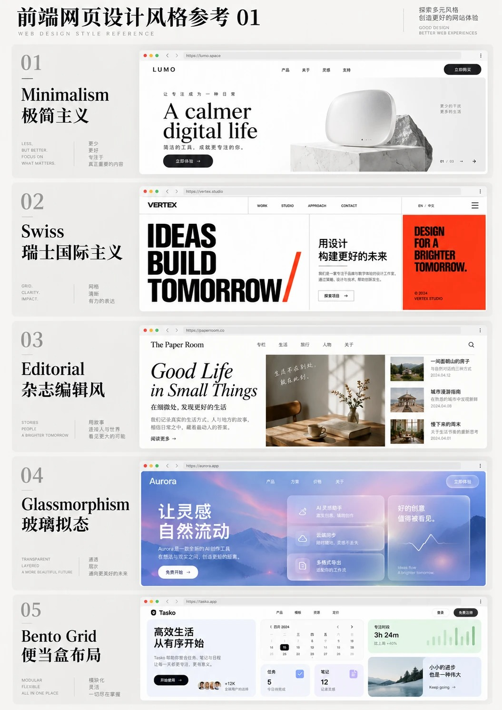](assets/examples/web-style-01.jpg) **[完整 Prompt](skills/aki-design-reference/references/web-style-01-04.md)** · [纯文本](https://raw.githubusercontent.com/gongfpp/imagegen-skills/main/skills/aki-design-reference/references/web-style-01-04.md) · [Skill](skills/aki-design-reference/SKILL.md) | **网页风格 02** [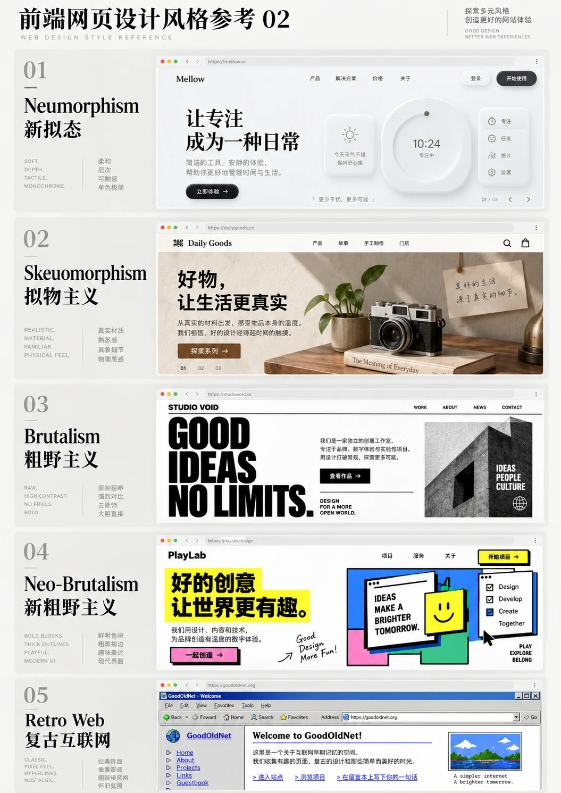](assets/examples/web-style-02.jpg) **[完整 Prompt](skills/aki-design-reference/references/web-style-01-04.md)** · [纯文本](https://raw.githubusercontent.com/gongfpp/imagegen-skills/main/skills/aki-design-reference/references/web-style-01-04.md) · [Skill](skills/aki-design-reference/SKILL.md) | **网页风格 03** [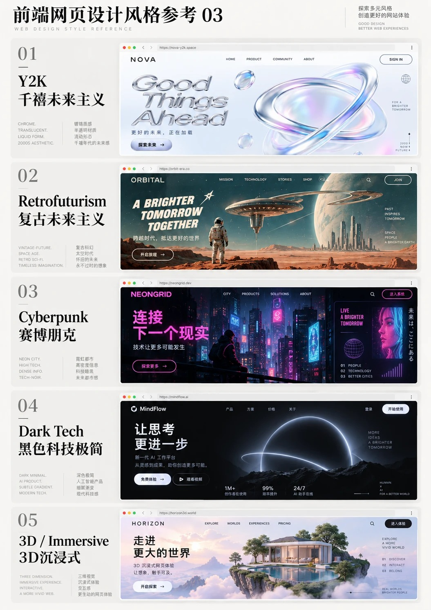](assets/examples/web-style-03.jpg) **[完整 Prompt](skills/aki-design-reference/references/web-style-01-04.md)** · [纯文本](https://raw.githubusercontent.com/gongfpp/imagegen-skills/main/skills/aki-design-reference/references/web-style-01-04.md) · [Skill](skills/aki-design-reference/SKILL.md) |
| **网页风格 04** [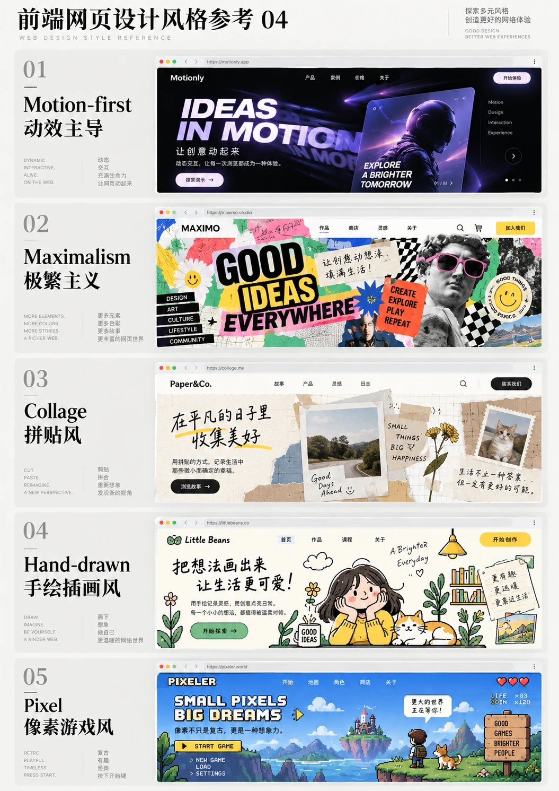](assets/examples/web-style-04.jpg) **[完整 Prompt](skills/aki-design-reference/references/web-style-01-04.md)** · [纯文本](https://raw.githubusercontent.com/gongfpp/imagegen-skills/main/skills/aki-design-reference/references/web-style-01-04.md) · [Skill](skills/aki-design-reference/SKILL.md) | **网页风格 05** [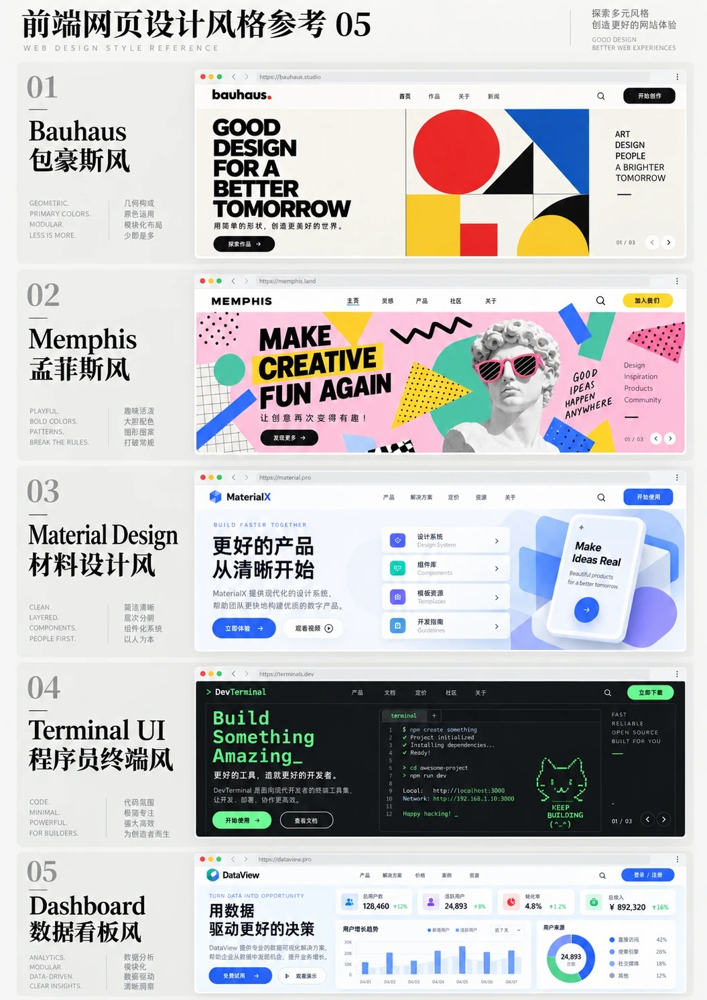](assets/examples/web-style-05.jpg) **[完整 Prompt](skills/aki-design-reference/references/web-style-05-08.md)** · [纯文本](https://raw.githubusercontent.com/gongfpp/imagegen-skills/main/skills/aki-design-reference/references/web-style-05-08.md) · [Skill](skills/aki-design-reference/SKILL.md) | **网页风格 06** [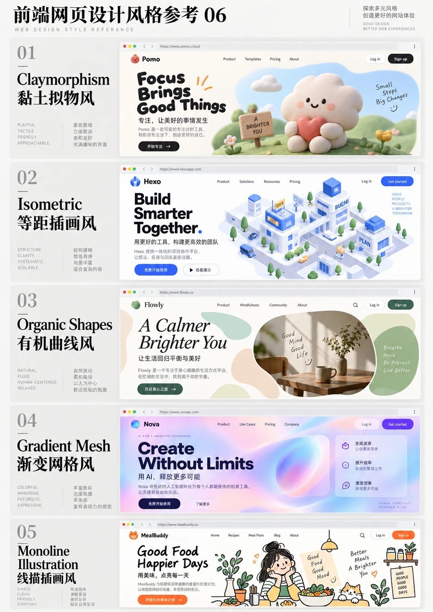](assets/examples/web-style-06.jpg) **[完整 Prompt](skills/aki-design-reference/references/web-style-05-08.md)** · [纯文本](https://raw.githubusercontent.com/gongfpp/imagegen-skills/main/skills/aki-design-reference/references/web-style-05-08.md) · [Skill](skills/aki-design-reference/SKILL.md) |
| **网页风格 07** [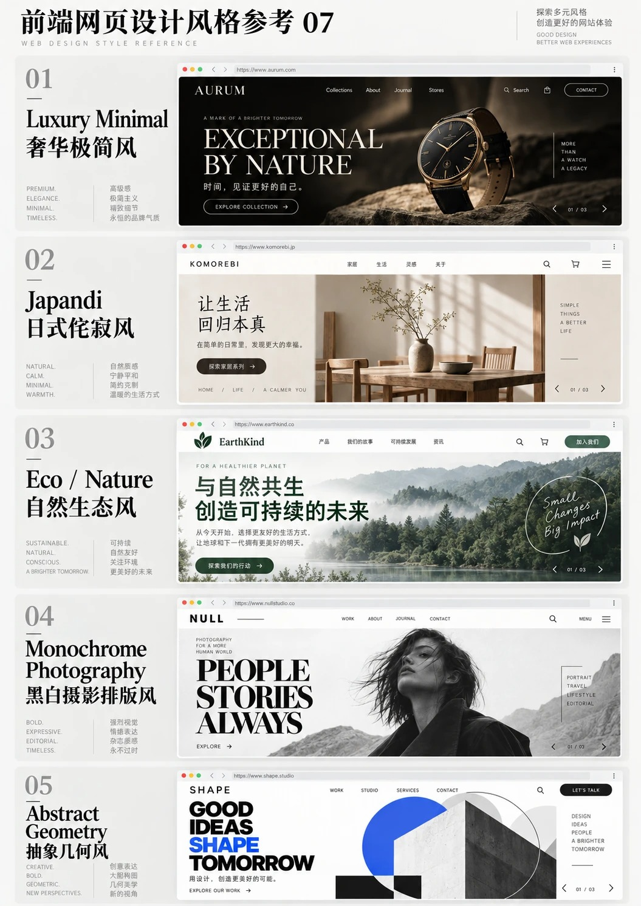](assets/examples/web-style-07.jpg) **[完整 Prompt](skills/aki-design-reference/references/web-style-05-08.md)** · [纯文本](https://raw.githubusercontent.com/gongfpp/imagegen-skills/main/skills/aki-design-reference/references/web-style-05-08.md) · [Skill](skills/aki-design-reference/SKILL.md) | **网页风格 08** [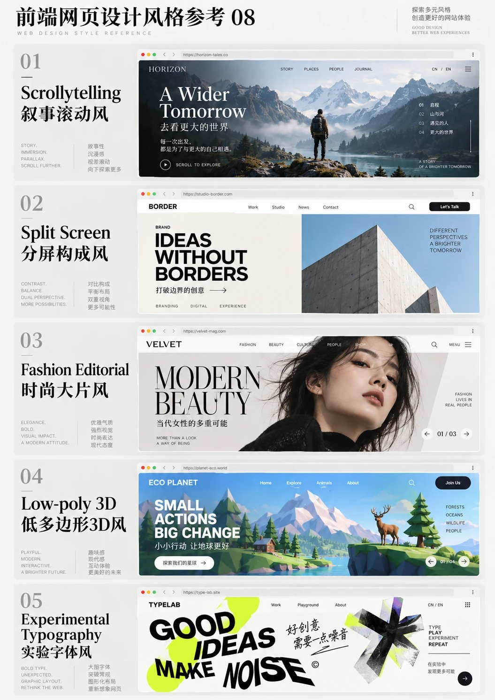](assets/examples/web-style-08.jpg) **[完整 Prompt](skills/aki-design-reference/references/web-style-05-08.md)** · [纯文本](https://raw.githubusercontent.com/gongfpp/imagegen-skills/main/skills/aki-design-reference/references/web-style-05-08.md) · [Skill](skills/aki-design-reference/SKILL.md) | **网页 / App 视觉风格** [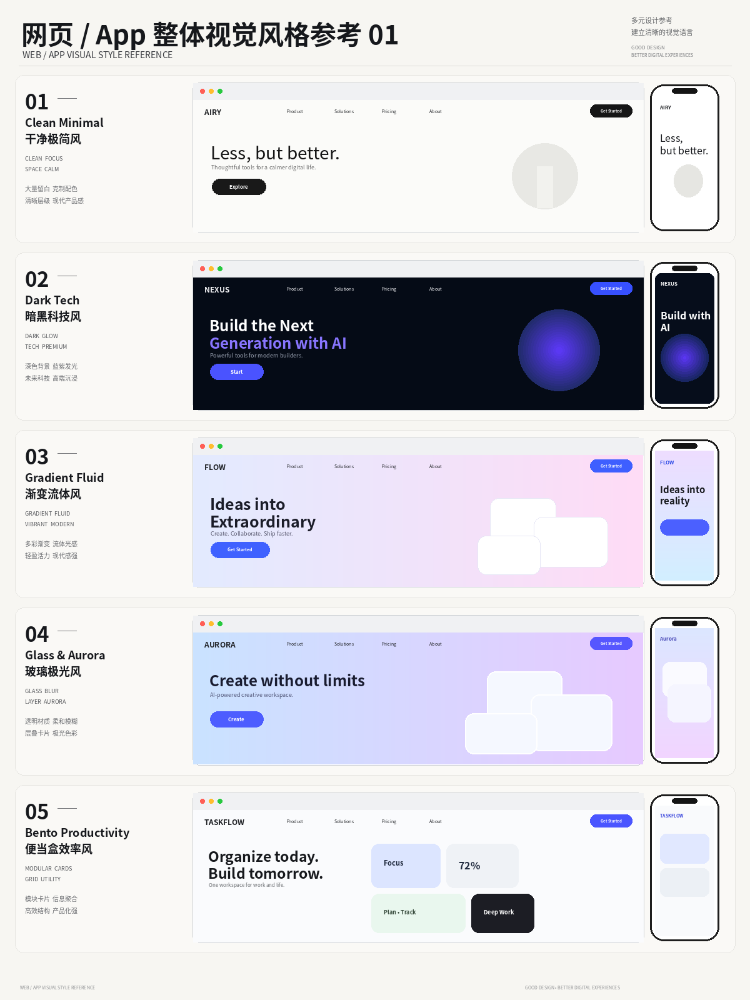](assets/examples/visual-style-template.png) **[完整 Prompt](skills/aki-design-reference/references/design-style-10-pages.md)** · [纯文本](https://raw.githubusercontent.com/gongfpp/imagegen-skills/main/skills/aki-design-reference/references/design-style-10-pages.md) · [Skill](skills/aki-design-reference/SKILL.md) [旧版四页](skills/aki-design-reference/references/archive/design-style-4-pages.md) 换主体，比较不同美术风格 |

## UI 组件设计

输入框、搜索框、Tab 和菜单使用同一套分类模板；复制后补上图片下方写明的主体即可。

| 合集示例 | 合集示例 | 合集示例 |
| --- | --- | --- |
| **导航结构** [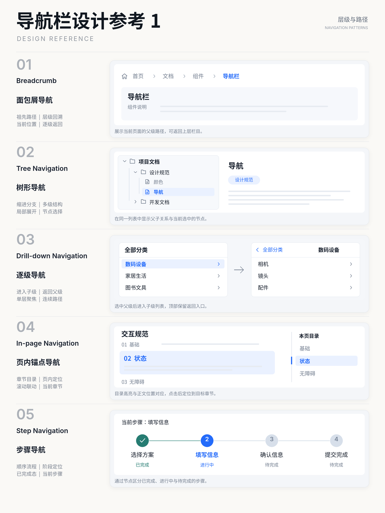](assets/examples/navigation-patterns.png) **[完整 Prompt](skills/aki-design-reference/references/navbar-01-04.md)** · [纯文本](https://raw.githubusercontent.com/gongfpp/imagegen-skills/main/skills/aki-design-reference/references/navbar-01-04.md) · [Skill](skills/aki-design-reference/SKILL.md) 面包屑、树形、页内与步骤导航 | **输入框分类** [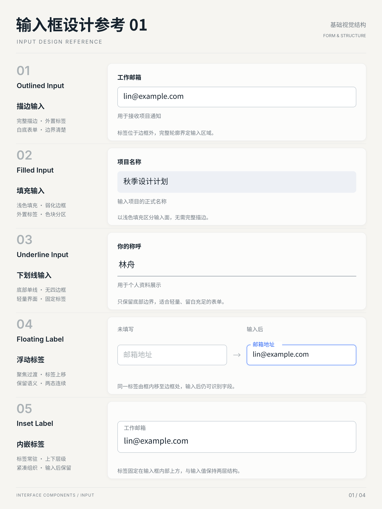](assets/examples/input-patterns.png) **[完整 Prompt](skills/aki-design-reference/references/design-pattern-10-pages.md)** · [纯文本](https://raw.githubusercontent.com/gongfpp/imagegen-skills/main/skills/aki-design-reference/references/design-pattern-10-pages.md) · [Skill](skills/aki-design-reference/SKILL.md) 使用时补充主体：输入框 | **搜索框分类** [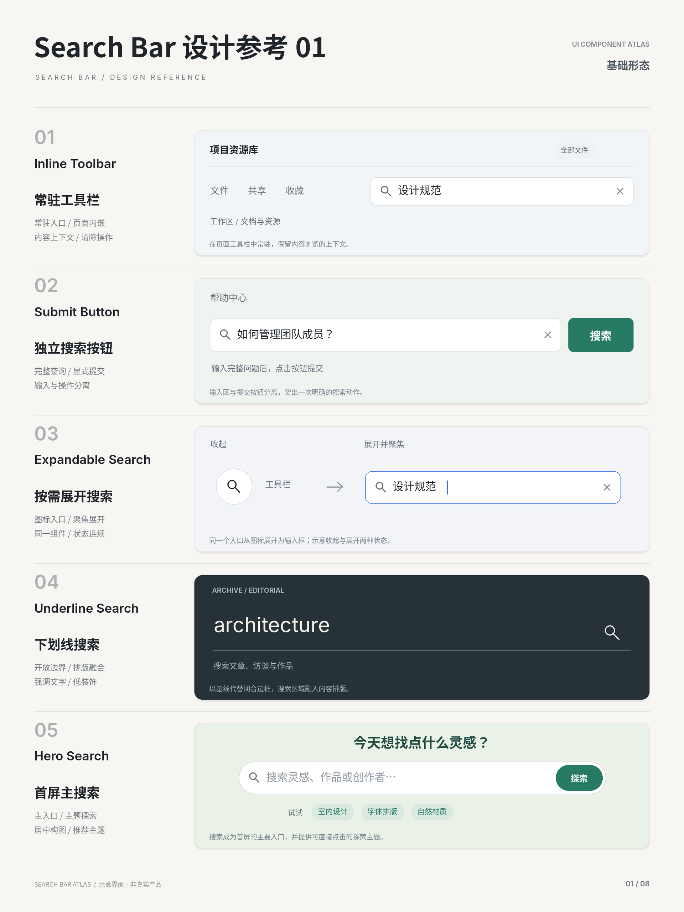](assets/examples/search-patterns.png) **[完整 Prompt](skills/aki-design-reference/references/design-pattern-10-pages.md)** · [纯文本](https://raw.githubusercontent.com/gongfpp/imagegen-skills/main/skills/aki-design-reference/references/design-pattern-10-pages.md) · [Skill](skills/aki-design-reference/SKILL.md) 使用时补充主体：搜索框 |
| **Tabs / 分段控件** [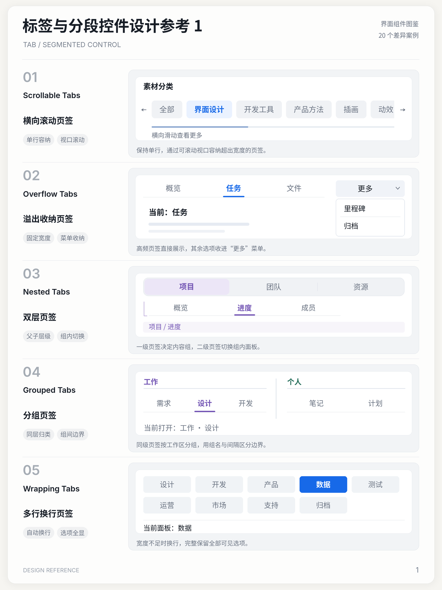](assets/examples/tab-patterns.png) **[完整 Prompt](skills/aki-design-reference/references/design-pattern-10-pages.md)** · [纯文本](https://raw.githubusercontent.com/gongfpp/imagegen-skills/main/skills/aki-design-reference/references/design-pattern-10-pages.md) · [Skill](skills/aki-design-reference/SKILL.md) 使用时补充主体：Tab / Segmented Control | **菜单 / 下拉框** [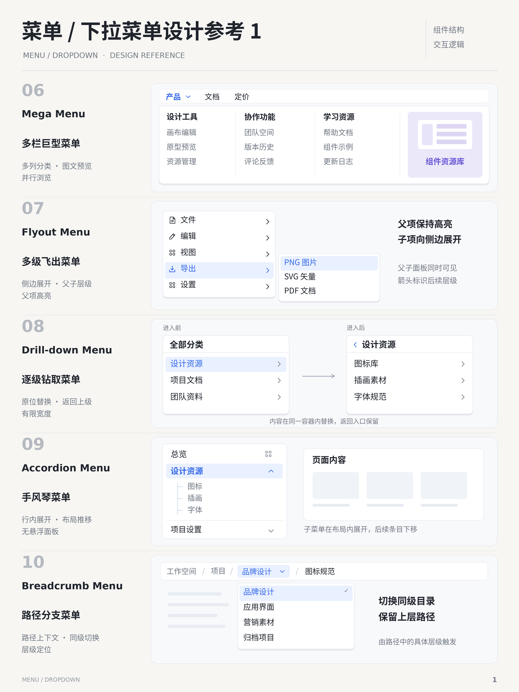](assets/examples/menu-patterns.png) **[完整 Prompt](skills/aki-design-reference/references/design-pattern-10-pages.md)** · [纯文本](https://raw.githubusercontent.com/gongfpp/imagegen-skills/main/skills/aki-design-reference/references/design-pattern-10-pages.md) · [Skill](skills/aki-design-reference/SKILL.md) 使用时补充主体：菜单与下拉框 | **通用组件分类** [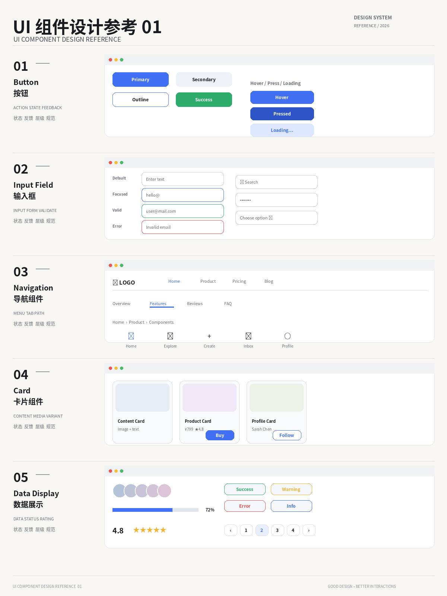](assets/examples/component-template.png) **[完整 Prompt](skills/aki-design-reference/references/design-pattern-10-pages.md)** · [纯文本](https://raw.githubusercontent.com/gongfpp/imagegen-skills/main/skills/aki-design-reference/references/design-pattern-10-pages.md) · [Skill](skills/aki-design-reference/SKILL.md) 按钮、输入、导航、卡片、数据显示 |

## 页面布局与 Landing Page

比较落地页的整体设计，或用通用母版自选页面类型与布局。

| 合集示例 | 合集示例 | 合集示例 |
| --- | --- | --- |
| **落地页 · 产品与科技** [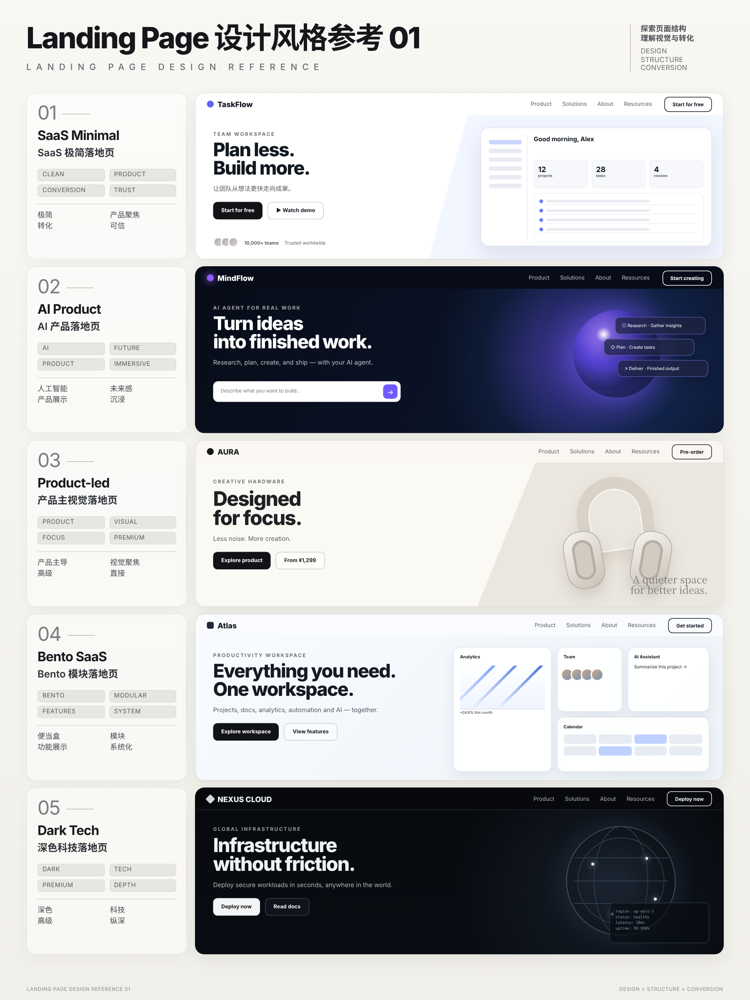](assets/examples/landing-page-01.png) **[完整 Prompt](skills/aki-design-reference/references/landing-page-01-04.md)** · [纯文本](https://raw.githubusercontent.com/gongfpp/imagegen-skills/main/skills/aki-design-reference/references/landing-page-01-04.md) · [Skill](skills/aki-design-reference/SKILL.md) | **落地页 · 编辑与创意** [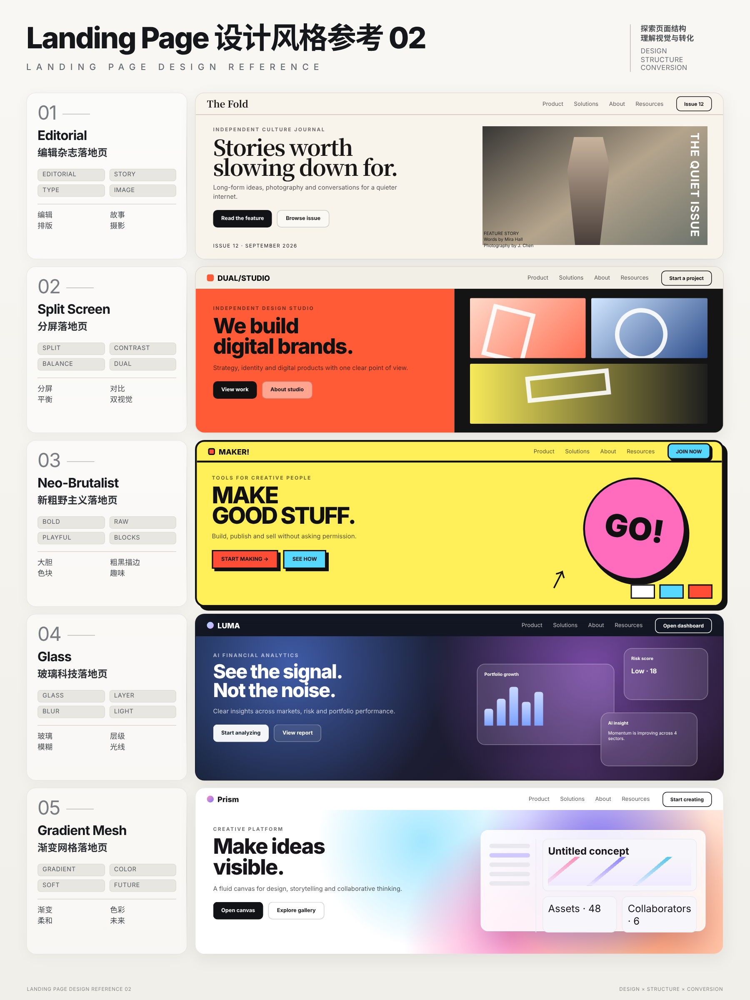](assets/examples/landing-page-02.png) **[完整 Prompt](skills/aki-design-reference/references/landing-page-01-04.md)** · [纯文本](https://raw.githubusercontent.com/gongfpp/imagegen-skills/main/skills/aki-design-reference/references/landing-page-01-04.md) · [Skill](skills/aki-design-reference/SKILL.md) | **页面布局与类型** [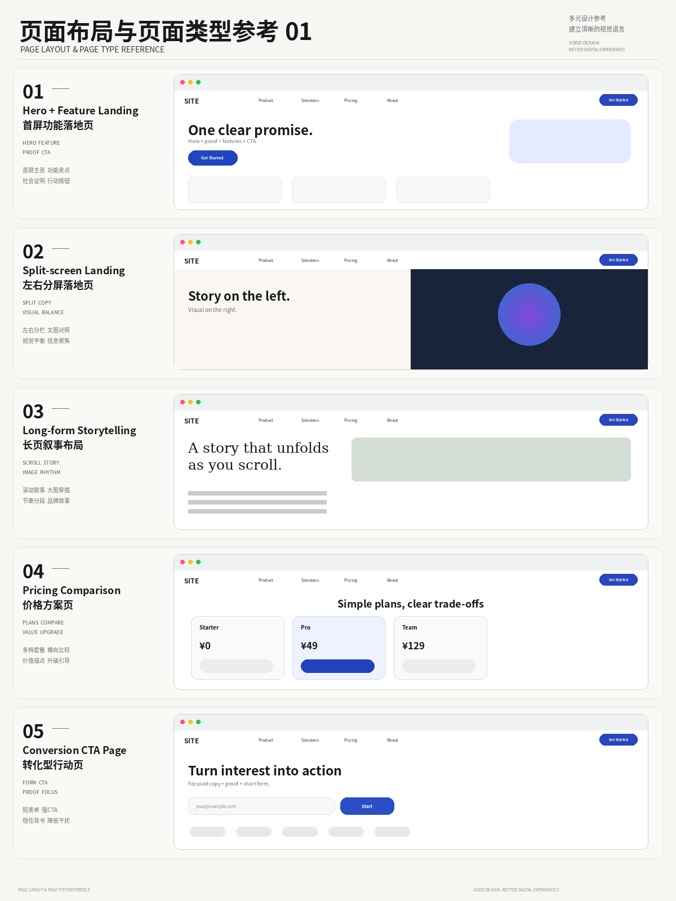](assets/examples/layout-template.png) **[完整 Prompt](skills/aki-design-reference/references/layout-master-4-pages.md)** · [纯文本](https://raw.githubusercontent.com/gongfpp/imagegen-skills/main/skills/aki-design-reference/references/layout-master-4-pages.md) · [Skill](skills/aki-design-reference/SKILL.md) 首屏、分屏、叙事、定价、转化 |

## 按钮动效与 UI 微交互

合集通过关键帧和状态序列表达动效，是静态设计参考。页面转场另有文字 Prompt，入口在微交互图片下方。

| 合集示例 | 合集示例 | 合集示例 |
| --- | --- | --- |
| **按钮动效 · 基础** [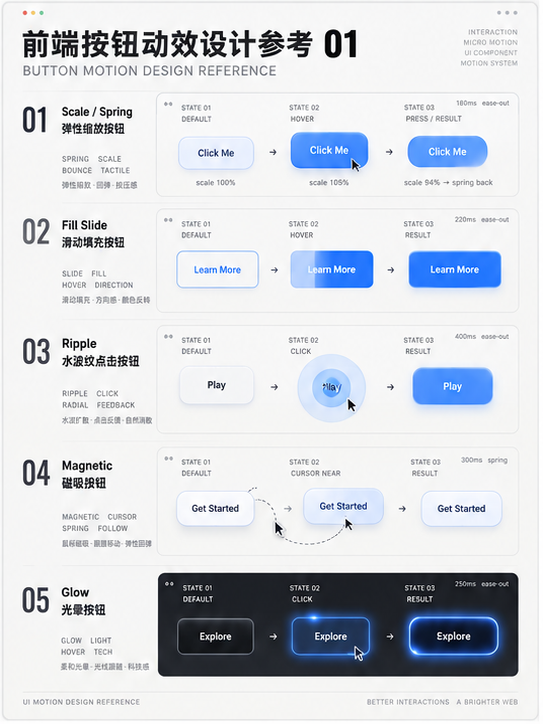](assets/examples/button-motion-01.png) **[完整 Prompt](skills/aki-design-reference/references/button-motion-01-04.md)** · [纯文本](https://raw.githubusercontent.com/gongfpp/imagegen-skills/main/skills/aki-design-reference/references/button-motion-01-04.md) · [Skill](skills/aki-design-reference/SKILL.md) | **按钮动效 · 扩展** [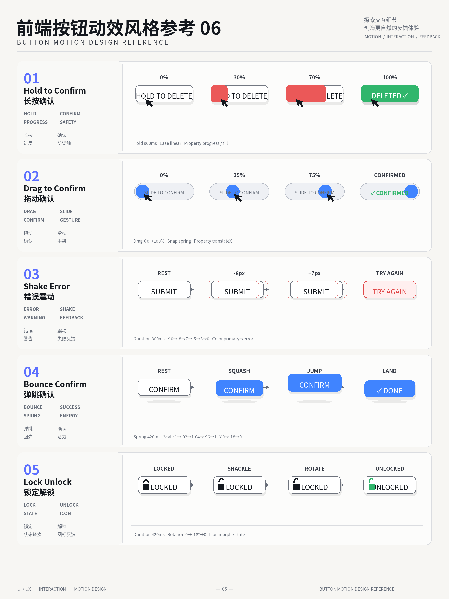](assets/examples/button-motion-06.png) **[完整 Prompt](skills/aki-design-reference/references/button-motion-05-08.md)** · [纯文本](https://raw.githubusercontent.com/gongfpp/imagegen-skills/main/skills/aki-design-reference/references/button-motion-05-08.md) · [Skill](skills/aki-design-reference/SKILL.md) | **UI 微交互** [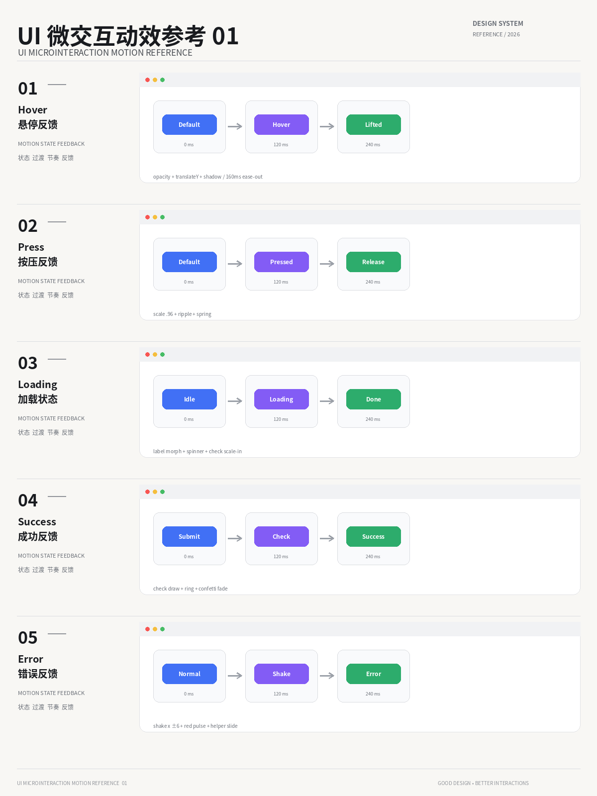](assets/examples/ui-microinteraction-01.png) **[完整 Prompt](skills/aki-design-reference/references/layout-master-4-pages.md)** · [纯文本](https://raw.githubusercontent.com/gongfpp/imagegen-skills/main/skills/aki-design-reference/references/layout-master-4-pages.md) · [Skill](skills/aki-design-reference/SKILL.md) [页面转场 Prompt](skills/aki-design-reference/references/page-transition-motion-01-04.md) 通用模板补充主体：UI 微交互 |

## 系列拟人插画

每格用一张九宫格展示整个系列，直接领取对应主题的完整 Prompt。

| 合集示例 | 合集示例 | 合集示例 |
| --- | --- | --- |
| **饮料拟人** [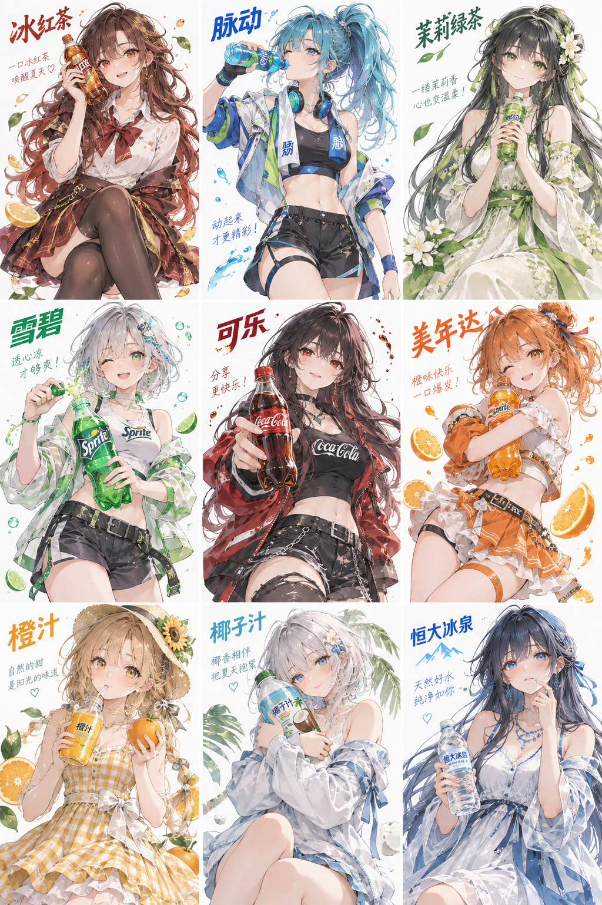](assets/examples/drinks-collection.png) **[完整 Prompt](skills/aki-gijinka-illustration/references/drinks-gijinka.md)** · [纯文本](https://raw.githubusercontent.com/gongfpp/imagegen-skills/main/skills/aki-gijinka-illustration/references/drinks-gijinka.md) · [Skill](skills/aki-gijinka-illustration/SKILL.md) 9 个主题的历史合集 | **瓶装水拟人** [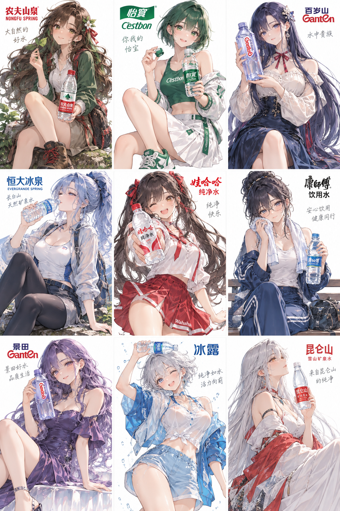](assets/examples/bottled-water-collection.png) **[完整 Prompt](skills/aki-gijinka-illustration/references/bottled-water-gijinka.md)** · [纯文本](https://raw.githubusercontent.com/gongfpp/imagegen-skills/main/skills/aki-gijinka-illustration/references/bottled-water-gijinka.md) · [Skill](skills/aki-gijinka-illustration/SKILL.md) 9 个主题的历史合集 | **地方美食拟人** [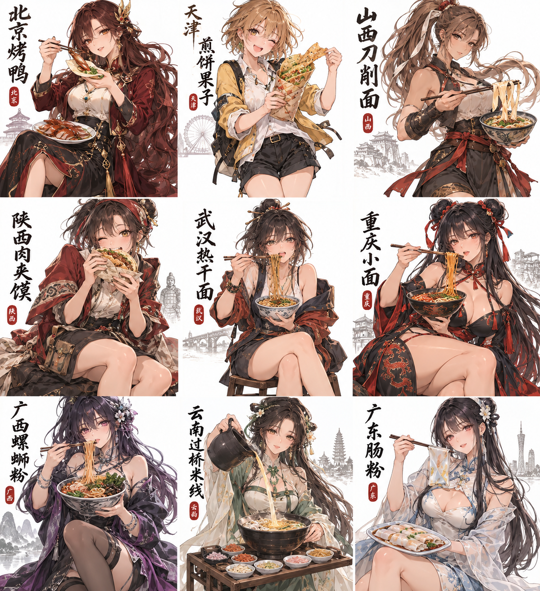](assets/examples/regional-food-collection.png) **[完整 Prompt](skills/aki-gijinka-illustration/references/regional-food-gijinka.md)** · [纯文本](https://raw.githubusercontent.com/gongfpp/imagegen-skills/main/skills/aki-gijinka-illustration/references/regional-food-gijinka.md) · [Skill](skills/aki-gijinka-illustration/SKILL.md) 9 个主题的历史合集 |
| **辣条拟人** [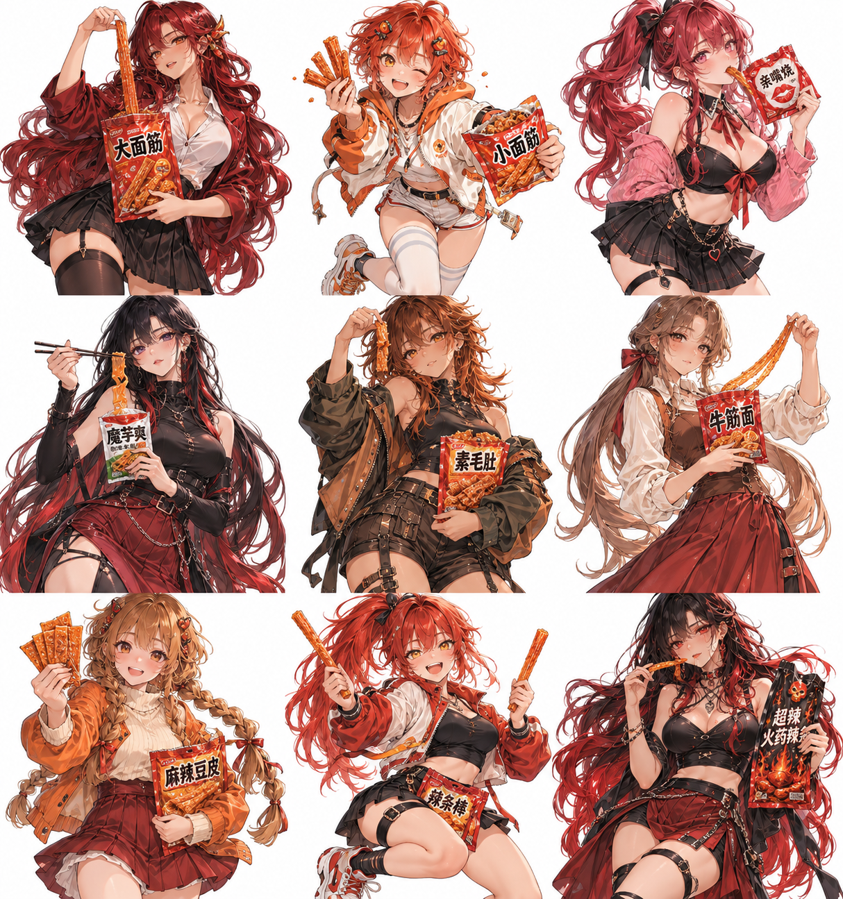](assets/examples/latiao-collection.png) **[完整 Prompt](skills/aki-gijinka-illustration/references/latiao-gijinka.md)** · [纯文本](https://raw.githubusercontent.com/gongfpp/imagegen-skills/main/skills/aki-gijinka-illustration/references/latiao-gijinka.md) · [Skill](skills/aki-gijinka-illustration/SKILL.md) 9 个主题的历史合集 | **冰淇淋拟人** [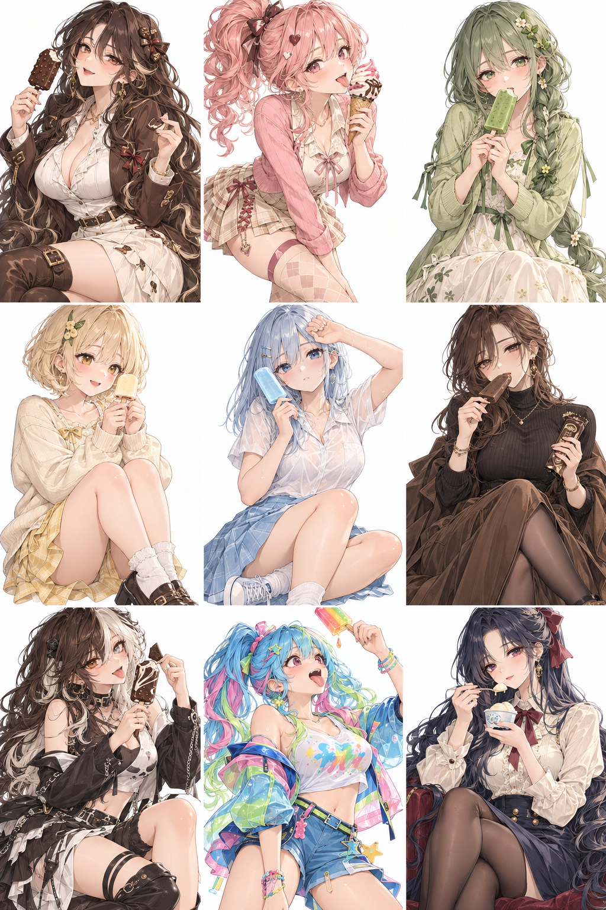](assets/examples/ice-cream-collection.png) **[完整 Prompt](skills/aki-gijinka-illustration/references/ice-cream-gijinka.md)** · [纯文本](https://raw.githubusercontent.com/gongfpp/imagegen-skills/main/skills/aki-gijinka-illustration/references/ice-cream-gijinka.md) · [Skill](skills/aki-gijinka-illustration/SKILL.md) 9 个主题的历史合集 | **软件拟人**  **[完整 Prompt](skills/aki-gijinka-illustration/references/software-gijinka.md)** · [纯文本](https://raw.githubusercontent.com/gongfpp/imagegen-skills/main/skills/aki-gijinka-illustration/references/software-gijinka.md) · [Skill](skills/aki-gijinka-illustration/SKILL.md) 9 个主题的历史合集 |

## 个人封面

这张是历史封面方向合集。当前 Skill 只固定三颗草和用户名「城下秋草」，背景、配色、比例和排版按当次主题调整。

| 合集示例 |
| --- |
| **个人封面 · 方向合集** [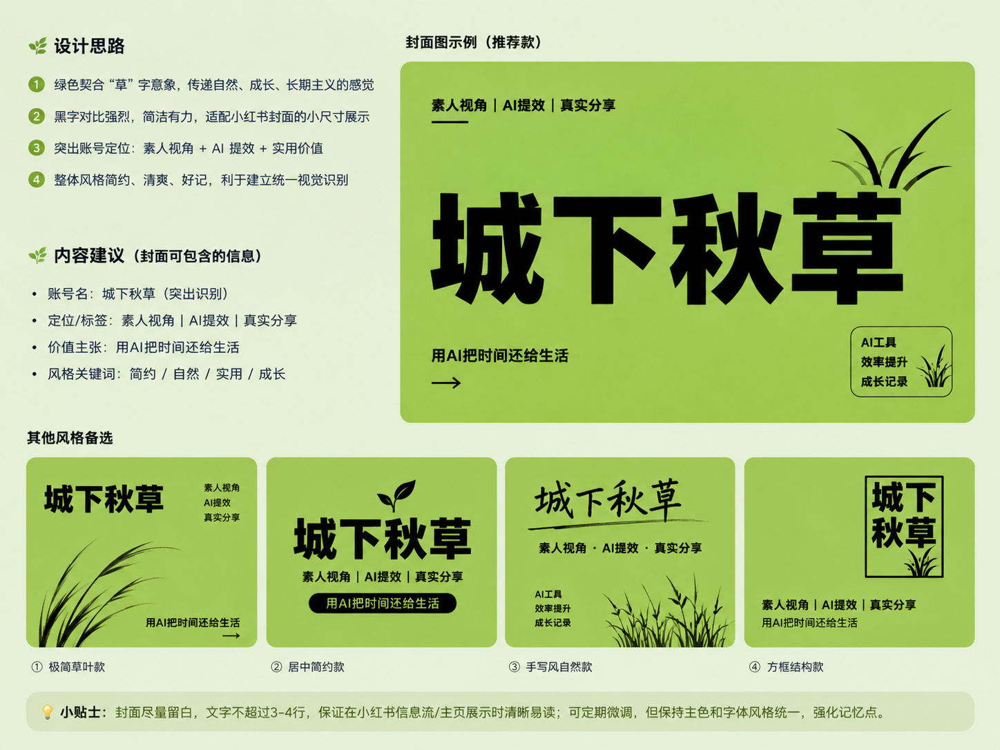](assets/examples/cover-collection.png) **[完整 Skill](skills/aki-rednote-cover/SKILL.md)** · [纯文本](https://raw.githubusercontent.com/gongfpp/imagegen-skills/main/skills/aki-rednote-cover/SKILL.md) 历史封面设计方向参考 |

## 第一次使用

1. 找到想要的合集，点击它下面的 **完整 Prompt**。
2. 点击 **纯文本 / Raw**，全选并复制完整内容。
3. 粘贴到支持生图的 AI 中。通用模板再补一句「本次主体是……」；需要多张图时可要求「每次生成一页，页码不要重复」。

展开查看：GitHub 领取与复制的图解教程

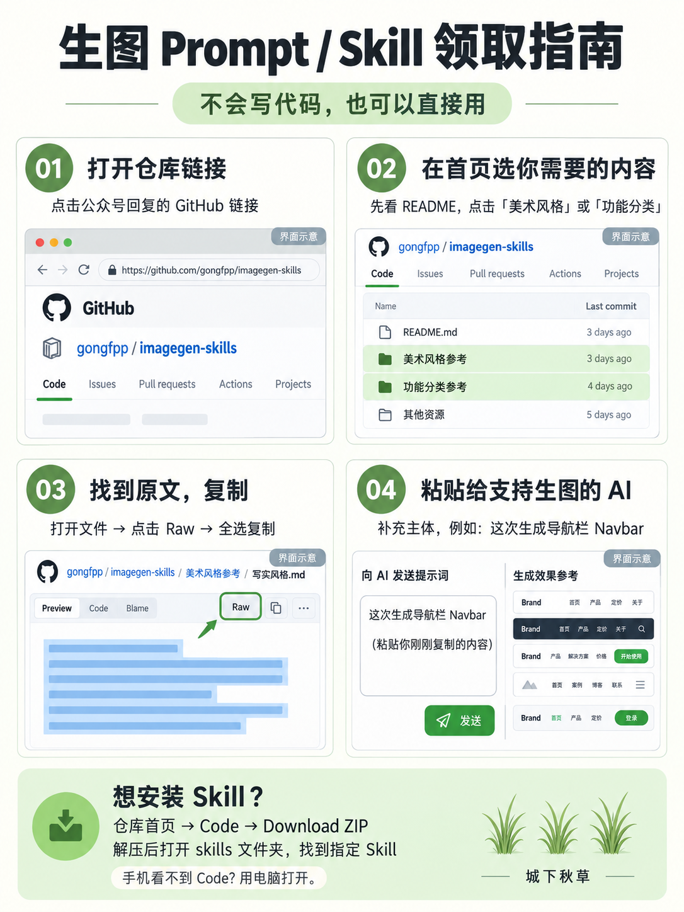

